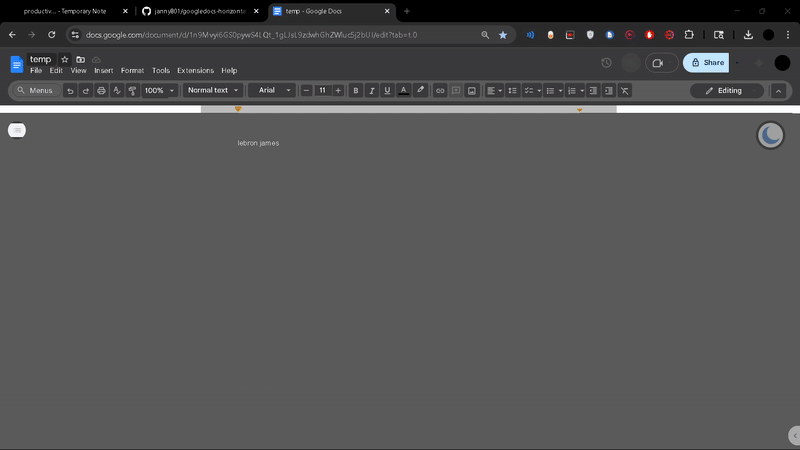

# Google Docs Horizontal Line Insert (AutoHotkey)

This AutoHotkey script provides a quick way to insert a horizontal line in Google Docs using a simple hotstring (`---`) or a custom hotkey (`Ctrl+Alt+H`).  
Instead of manually navigating to **Insert → Horizontal line**, the script automates the key sequence (`Alt + i, r`) for you.

## Features
- **Hotstring trigger:** Type `---` and it is instantly replaced with a horizontal line.  
- **Hotkey trigger:** Press `Ctrl+Alt+H` to insert a horizontal line at the cursor.  
- **Google Docs only:** Script is active only when a Google Docs tab in Chrome is focused.  
- **Customizable:** Adjust wait times (`Sleep`) or change hotkeys easily.

## Demo
  

## Run on Startup
To make the script run automatically every time you log in:

1. Press `Win + R`
2. Type `shell:startup` and press Enter  
   *(This opens your Startup folder)*
3. Go to the folder where your `.ahk` script is saved
4. Right-click your `.ahk` file → **Copy**
5. Go back to the Startup folder → Right-click → **Paste shortcut**

## License

This project is licensed under the MIT License. See the [LICENSE](LICENSE) file for details.

## Contact

For questions or feedback, reach out via email:
- **Email**: jred8069@gmail.com

